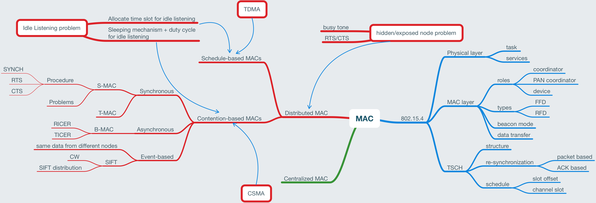
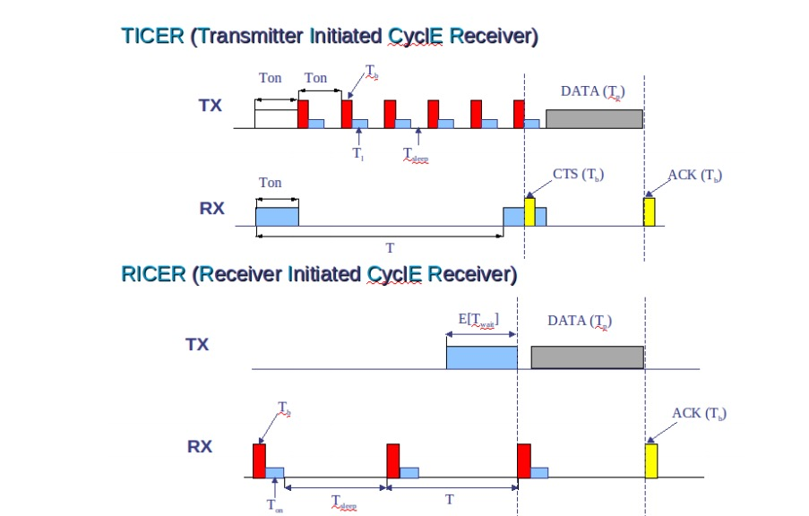
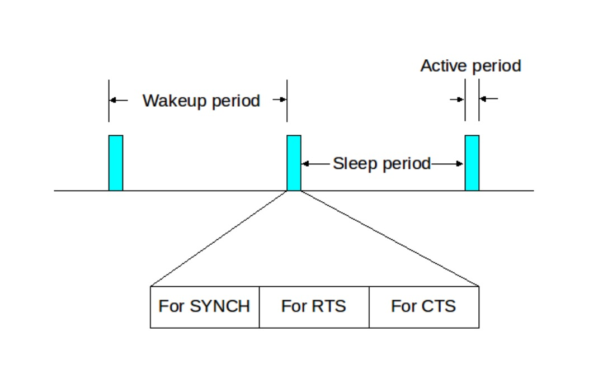
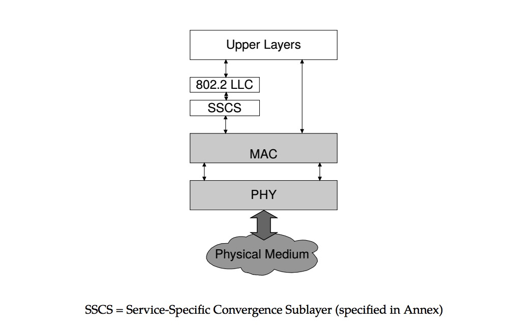

# Global Structure

# Fundamentals
## Introduction
### Wireless Medium Access Control
1. Wireless channels are half-duplex
2. No real collision detection functionality

### Centralized Medium Access
1. Idea: a central station regulates access to the medium
    1. Examples: polling strategies, centralized computation of TDMA schedules
    2. Advantages: easy to avoid collisions, easy guarantee of regular access to nodes
    3. Disadvantages:
        1. Allocation-deallocation protocols are required
        2. Central controller can be complex
        3. Single point of failure
        4. TDMA: time synchronization
2. Rarely used in wireless multi-hop networks
3. But: quite useful when network is divided into smaller groups
4. In MANETs and WSNs usually **distributed medium access** is considered

### Schedule- vs. contention-based MACs
1. **Schedule-based MACs**:
    1. A schedule regulates who uses channel at which time
    2. Schedule can be created a-priori(offline) or on demand
    3. TDMA must be supported by time synchronization[todo]
2. **Contention-based MACs**:
    1. Risk of colliding packets is deliberately taken
    2. Hope: coordination overhead can be saved, resulting in overall improved efficiency
    3. Mechanisms to handle/reduce probability/impact of collisions required

       Popular approach: CSMA - "listen before you send, listen while sending, don't send while collisions, send later"
    4. Usually, **randomization** is used somehow

## Hidden-terminal problem and solutions
1. Scenarios
    1. Hidden terminal: A->B, C->B, then collision
    2. Exposed terminal: B->A, C->D, C senses medium busy and defer
    3. [todo]figure
2. Solutions
    1. Busy-Tone solution
        1. use 2 frequency bands:
            1. *data band* is used to transmit data packets
            2. *busy-tone band* is used to transmit busy tone signals
        2. Approach:
            1. While receiving a data packet a station sends an ongoing signal on the busy tone band
            2. The carrier sensing is performed on the busy-tone channel
        3. both problems(hidden and exposed) solved
        3. problems
            1. more spectrum/hardware
            2. if busy tone has smaller transmission range than data signals, collisions still possible
            2. if busy tone has larger transmission range, then theoretically feasible transmissions can be suppressed
            3. The busy tone channel is narrowband => frequency synchronization required
    2. RTS/CTS protocol
        1. uses only a single channel, but requires the exchange of small control packets before data transmission
        2. send RTS(request to send) before sending; send CTS(clear to send) to answer CTS.
        3. [todo]figure
        4. exposed-terminal problem is not solved
        4. Hidden-terminal problem is not completely solved
        5. MANETs: IEEE 802.11 uses RTS/CTS
        6. WSNs: IEEE 802.15.4 uses no RTS/CTS

# MACs for WSNs
## Introduction
### Sources of energy waste
1. Collisions
2. Overhearing
3. Protocol overhead
4. Idle listening

### Deal with Idle Listening
1. In 802.11: TIM and sleeping

   nodes that have data buffered for receivers(e.g. APs) send **traffic indictors**(TI) at pre-arranged points in time, receivers need to wake up at these points, but can sleep otherwise. If TI indicates buffered packets to a receiver, it remains awake and exchanges data with transmitter
2. In WSNs
    1. Schedule-based(TDMA) approaches
    2. Contention approaches
      3. Nodes wake up periodically, wait for incoming transmissions and  go back to sleeping
      4. Ratio of awake time to period is called **duty cycle**

## Asynchronous contention-based schemes
### Intro
1. Common feature:
  1. A node picks his duty cycle independent of other nodes
  2. to achieve rendezvous between transmitter and receiver, one of them must do additional work
2. Some schemes:
  3. B-MAC
  4. RICER/TICER

### Preamble sampling
1. Receiver wakes up periodically to check channel for presence of energy
  2. Awake time fixed
  3. Wake-up period could be variable
  4. That is to say, node will wake up n seconds later every time sleeping. However, it is variable how long it will keep awake.
5. Node goes back to sleep when:
  6. Packet is successfully received
  7. After timeout
6. Transmitter uses a **long preamble** to ensure that receiver stays awake to catch actual packet.
  7. Preamble must have the same length as the wakeup period
8. Examples: B-MAC

### RICER and TICER
1. TICER(Transmitter Initiated CyclE Receiver)

   Similar to preamble sampling
2. RICER(Receiver Initiated CyclE Receiver)

   Invert approach: receiver transmits small beacons upon wakeup, a prospective transmitter responds to this and continues with data exchange
3. Figure:

   

## Synchronized contention-based schemes(S-MAC)
### Approach:
1. each node picks up a **schedule**, according to which it wakes up periodically
2. packet exchanges take place during active periods using CSMA with RTS/CTS handshake
3. nodes periodically broadcast their schedule
3. nodes try to adopt the same schedule as their neighbors

### Procedure
1. A node x alternates between listen periods and sleep periods, its listen period is subdivided into 3 phases
2. **SYNCH phase**: x receives SYNC H packets from its neighbors (using CSMA scheme), in which they specify their schedule
4. Conversely, x has the duty to send his own schedule to a neighbor y in y's SCNCH phase
5. x's and y's SYNCH phase may overlap
6. **RTS phase**: x listens to RTS packets from neighbors
7. **CTS phase**: x transmits a CTS if necessary, actual data transfer takes place subsequently
1. figure

   

### other
1. Nodes try to pick up schedule synchronization from neighboring Nodes
2. If no neighbor found, node picks own schedule
3. If additional nodes join, some nodes might learn about two different schedules
4. To achieve connectivity, such a node has to follow both schedules

### problems
1. latency
2. synchronized senders
3. fixed active time, does not adapt to load
  4. Duty cycle has to be configured for maximum Lab1_Toolchain_and_Demo
  5. **T-MAC** allows to adaptively shorten the listen period
4. non-neighbored islands choose their cycle phase independently

## Event-based MACs
### Introduction
1. In WSNs different nodes may want to transmit the same or similar data
2. Suppressing correlated data reduces channel contention
3. 2 example: Sift, CC-MAC

### SIFT
1. It is designed to support situations in which one has:
  2. Nearly simultaneous packet arrivals to many nodes
  2. Identical or highly correlated packets, so that not all contenders really need to transmit
3. Important design goal: to have the first successful packet transmission as quickly as possible, so that further contenders can suppress their packets

### SIFT CONTENTION SCHEME
1. Time after a DATA/ACK exchange is subdivided into a fixed number of minislots:
  2. **Fixed contention window**(CW)
3. At the beginning of the contention window each contender x randomly picks on slot r according to the SIFT distribution
3. Contender x listens for r-1 slots
  1. If another contender starts in this time, x has lost contention
  2. If no other contender starts, x starts transmitting at the beginning of slot r
3. After losing contention x can drop its packet
4. Generalization: x drops packet after having overheard R times the same packet

# IEEE 802.15.4
## IEEE 802.15.4 Overview and Architecture
### Key Characteristics
1. "Low-rate Wireless Personal Area Network"(LR-WPAN)
1. Asymmetric: different types of nodes with different roles
3. Low complexity compared to IEEE 802.11

### Architecture

## Physical layer
### PHY services
1. Data service: interface data units are whole MAC packets
2. PHY mode changes:
  3. Services for activation and deactivation of transceiver
  2. Channel selection
3. CCA services = Clear Channel Assessment
4. Phy can at any time report the energy found on a channel

## MAC layer
### Types and roles of stations
1. 3 types of roles:
  2. A *coordinator* communicates with *devices* and other coordinator, in multi-hop networks acts as router
  2. A *PAN coordinator* is a special coordinator that starts the PAN and selects its major operational parameters(e.g. frequency, duty cycle)
  3. A *device* only communicates with (PAN) coordinators after association, not in peer-to-peer mode with other devices
2. 2 types of stations
  3. A *full function device* (FFD) can operate in all three roles
  4. A *reduced function device* (RFD) only operate as device

# LPWAN
