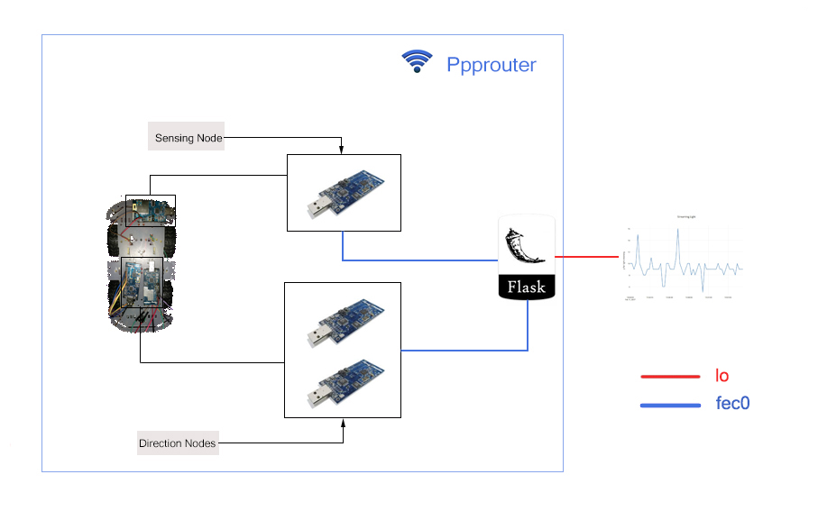

# Introduction
Our project implements a smart sensing car through which we can get data from sensors remotely. 

## Hardware
2. 4\*TELOSB
3. 1 motor

# Software(Operating Systems)
1. TinyOS
2. Flask

# Technique
2. Flask
4. Sensing methods in TinyOS
3. GPIO library in Raspbian
3. html/css

## Scenario:
1. smart car with sensors, which can be remote controlled. We control the car driving to somewhere we want. And the sensor will sample the data(Temperature, Humidity, Light) in real-time and delivered it to the web server through Ppprouter. The web server will visualize these data and we are able to see them when we access the web server through any device inside the network.
2. When the car ran into a dark area(L < threshold), the car will open its spotlight(a Led in our project) to make the camera(we don't have and use a camera in this project) capture the image successfully. Of course, the threshold can be set remotely.

## Group members
1. Hui Yin
2. Jiapeng Li
2. Jiawen Wang
4. Zhiwei Liu

# Structure
This part shows the basic structure of this project and how to run the it. 

There are 4 parts in this project: *PppRouter*, *Direction*, *Sensing*, *Server*.

Here is the basic block diagram:

## PppRouter
Set up a router to communicate with other nodes through IPv6.

## Direction
This part is responsible for controlling direction. There are 2 subparts:

1. Hardware-level control:

   Mainly written in nesC and aimed to control the GPIOs. And the motor is wired to the GPIOs directly. Some basic shell commands have been implemented here, e.g., **forward**, **backward**, **stop**.

2. Software-level interface:

   Mainly written in python and implemented some other commands through the integration of the basic commands above, such as **left**, **right**. Also, it provides a python interface through which user could send all those commands directly instead of running commands line in the node shell through **nc6** command.

## Sensing
This part is mainly used for sensing data through the sensors. And those data will be visualized on a webpage(localhost:5000/dada) when starting flask server. Similarly to the Direction part, there is also a high-level interface being implemented(also written in python).

## Server
Set up a flask server to visualize the controller page and the sensed data. Web page UIs are mainly implemented in this part under statics/ and templates/ directories. At the same time, the server could directly use and call the interfaces which have been implemented in the **Direction** nd **Sensing** parts. 
