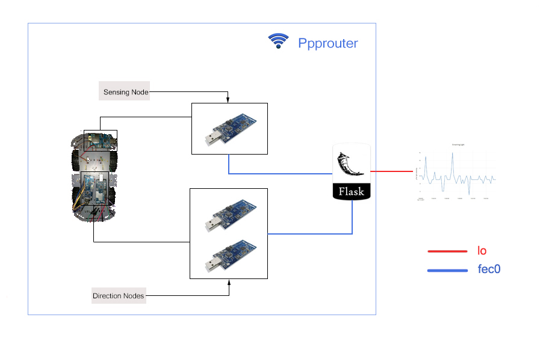

# Introduction
This page shows the basic structure of this project and how to run the it. 

There are 4 parts in this project: *PppRouter*, *Direction*, *Sensing*, *Server*.

## PppRouter
Set up a router to communicate with other nodes through IPv6.

## Direction
This part is responsible for controlling direction. There are 2 subparts:

1. Hardware-level control:

   Mainly written in nesC and aimed to control the GPIOs. Some basic commands have been implemented here, e.g., **forward**, **backward**, **stop**.

2. Software-level interface:

   Mainly written in python and implemented some other commands through the integration of the basic commands above, such as **left**, **right**. Also, it provides an interface through which user could send all those commands directly instead of running commands line in the node shell through **nc6** command.

## Sensing
This part will be used for sensing data from its sensors. Similarly to the Direction part, there is also an high-level interface being implemented(also written in python). In this project, the sensor will sense the humidity and the light. There is a threshold of the light (default is 100). If the light is smaller than the threshold, the led will be turned on.

### Start Ppp Router
```sh
$ cd PppRouter
$ make telosb install
```

### Start sampling:
```sh
$ cd Sensing/utils/
$ make telosb install,2 bsl,/dev/ttyUSB1
$ python streaming.py
```
## Server
Set up a flask server to visulize the controller page and the sensed data. Web page UIs are mainly implemented in this part under statics/ and templates/ directories. At the same time, the server could directly use and call the interfaces which have been implemented in the **Direction** nd **Sensing** parts. 
### Start the server:
```sh
$ cd Server/
$ export FLASK_APP = server.py
$ flask run
```

### Access the controller page using the address:
> 127.0.0.1:5000

### Access the data page using:
> 127.0.0.1:5000/data

## Summary


